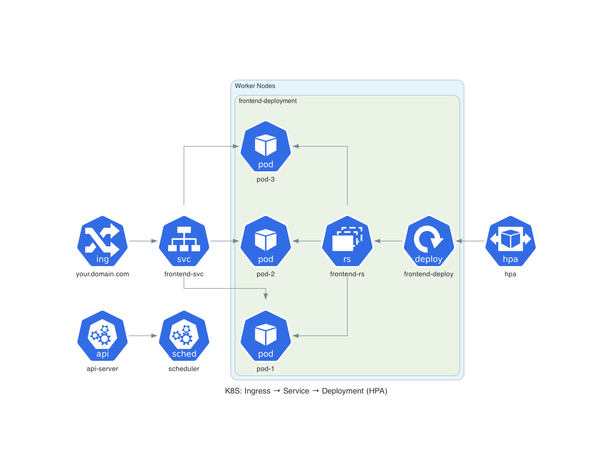
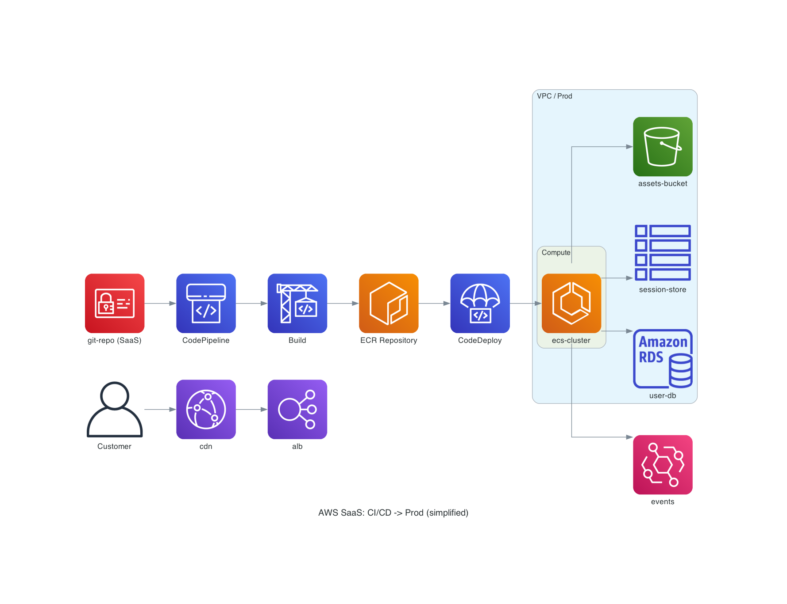
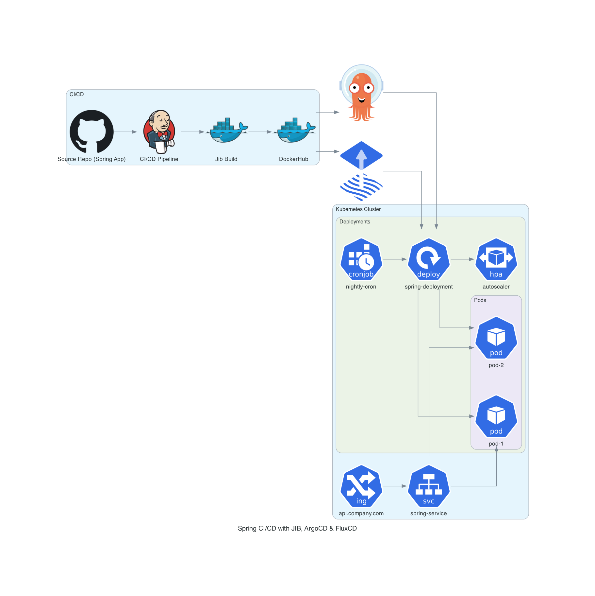

# Cloud-Native Architecture Diagrams with Python

Hi 👋 I’m a cloud-native–focused developer, working across **microservices**, **modern frameworks**, and **cloud platform provider components**.  

One big challenge in this space:  
- Preparing clear **architecture diagrams** takes too much time.  
- Lining up boxes, connecting arrows, and hunting for proper service icons is frustrating.  
- Many commercial diagramming tools cost **~$100/year**, which I don’t want to pay.  

After research, I discovered that **Python + [Diagrams](https://diagrams.mingrammer.com/)** (diagram-as-code) solves these problems:
- Free and open source  
- Reproducible diagrams under version control  
- Supports AWS, GCP, Azure, Kubernetes, CNCF, on-prem, and more  
- Easy to extend with **custom icons** for projects like ArgoCD or FluxCD  

---

## What’s in this repository?

This repo contains **hands-on demos** showing how to use the Diagrams library to model real-world cloud-native scenarios:

- Kubernetes clusters (Ingress → Service → Deployment → Pods)  
- AWS SaaS pipeline (CodePipeline → ECR/ECS → RDS/S3)  
- Spring application CI/CD with JIB → DockerHub → ArgoCD/FluxCD → Kubernetes  
- GitOps flows with custom icons  
- CronJobs, scaling, observability stacks, and more  

Each example comes with:
1. The **Python script** (`.py`)  
2. The **generated diagram image** (`.png` / `.svg`)  

You can copy any script, run it locally, and get the same diagram.

---

## Why this matters

By practicing with these examples:
- You’ll master **diagram-as-code** for cloud-native architectures  
- You can integrate diagram generation into your docs or CI pipelines  
- You’ll save hours compared to drag-and-drop tools  
- You’ll never struggle with paying for expensive subscriptions  

---

## Diagram As Code Generated Diagrams 
### Kubernetes Architecture 


### AWS SaaS Pipeline 


### Customized Spring & JIB & ArgoCD & Kubernentes 


---

## How to use

1. Install dependencies:

```bash
   python3 -m venv venv && source venv/bin/activate
   brew install graphviz   # or apt-get install graphviz
   pip install diagrams
```
2. Run any example: 
```bash
    python k8s_arch.py
```

This command gonna generate `k8s_arch.png`. 

3. Try editing and creating your own diagrams

---

## Roadmap 

- Kubernetes & AWS examples 
- Spring + Jib + DockerHub + ArgoCD/FluxCD GitOps demo
- Add observability stack (Prometheus/Grafana/Loki)
- Add service mesh (Istio, Linkerd)
- Add multi-cloud hybrid architectures 

---

## References

These articles and documentation were very useful in shaping this project and provide more examples and context:
- [Top 7 Diagrams as Code Tools for Software Architecture — Medium (IcePanel)](https://icepanel.medium.com/top-7-diagrams-as-code-tools-for-software-architecture-1a9dd0df1815)

- [7 Open-Source Diagram-as-Code Tools You Should Try — Medium (Prateek Jain)](https://blog.prateekjain.dev/7-open-source-diagram-as-code-tools-you-should-try-d13d0e972601)

- [Diagrams Official Docs — Getting Started & Installation](https://diagrams.mingrammer.com/docs/getting-started/installation)

Big thanks 🙏 to the Diagrams community and documentation for providing clear, practical examples.

---

## License 

[Apache 2.0](./LICENSE)
